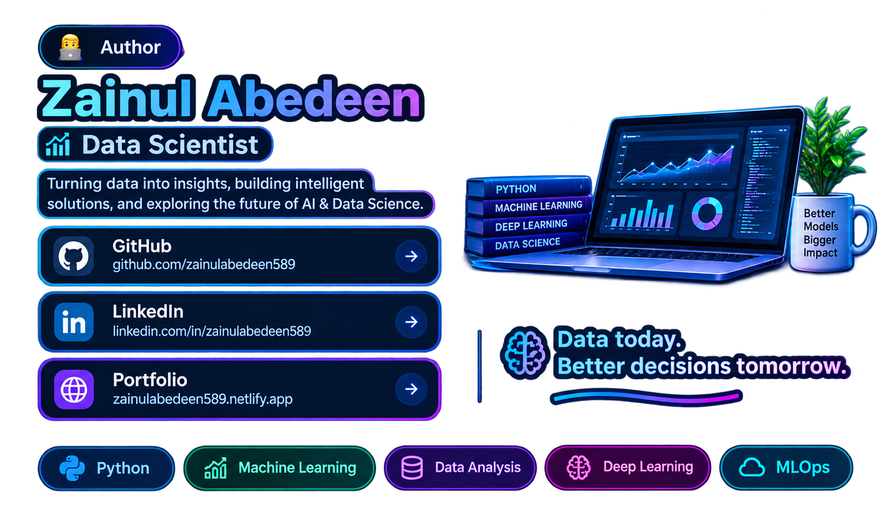
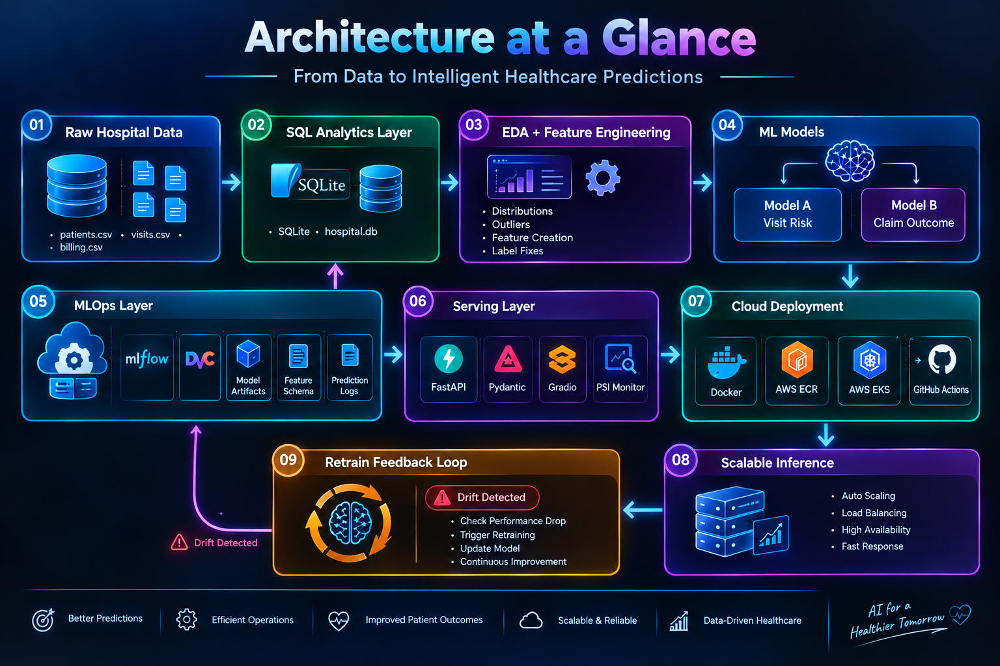
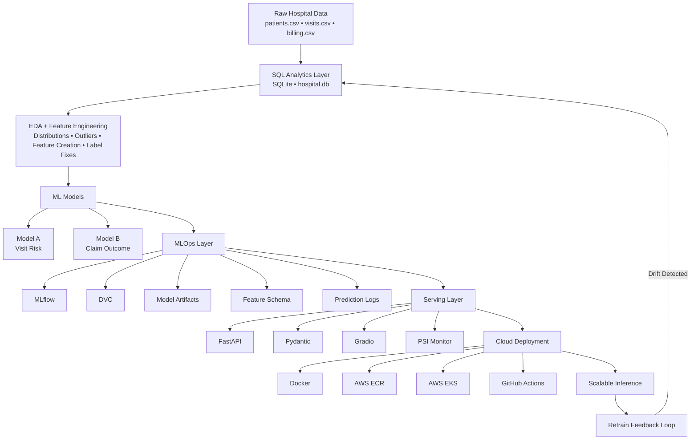
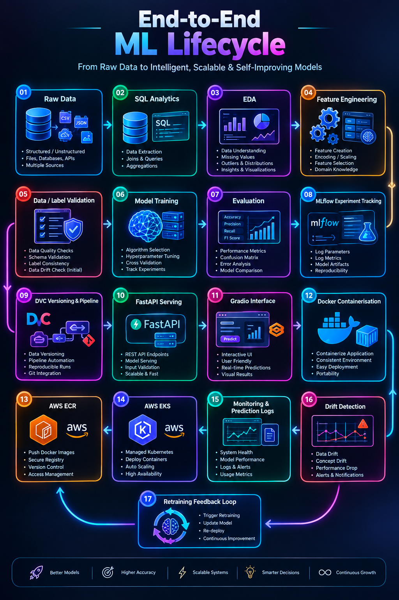
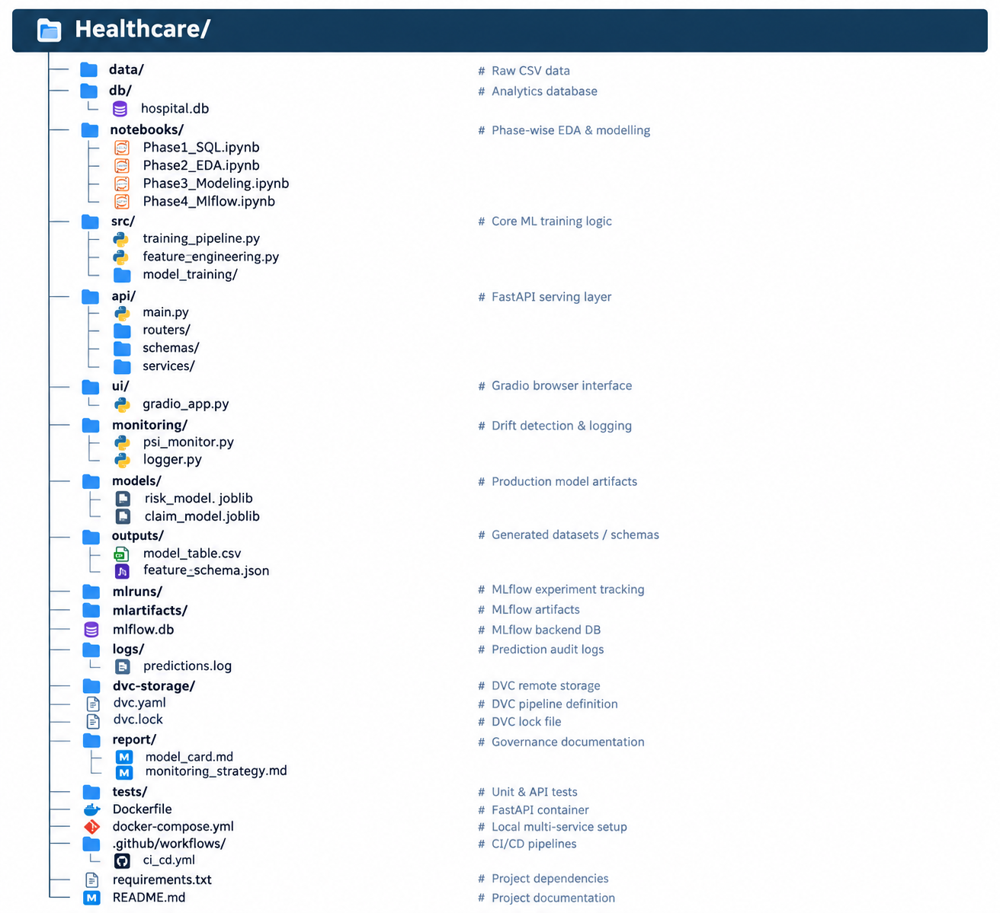
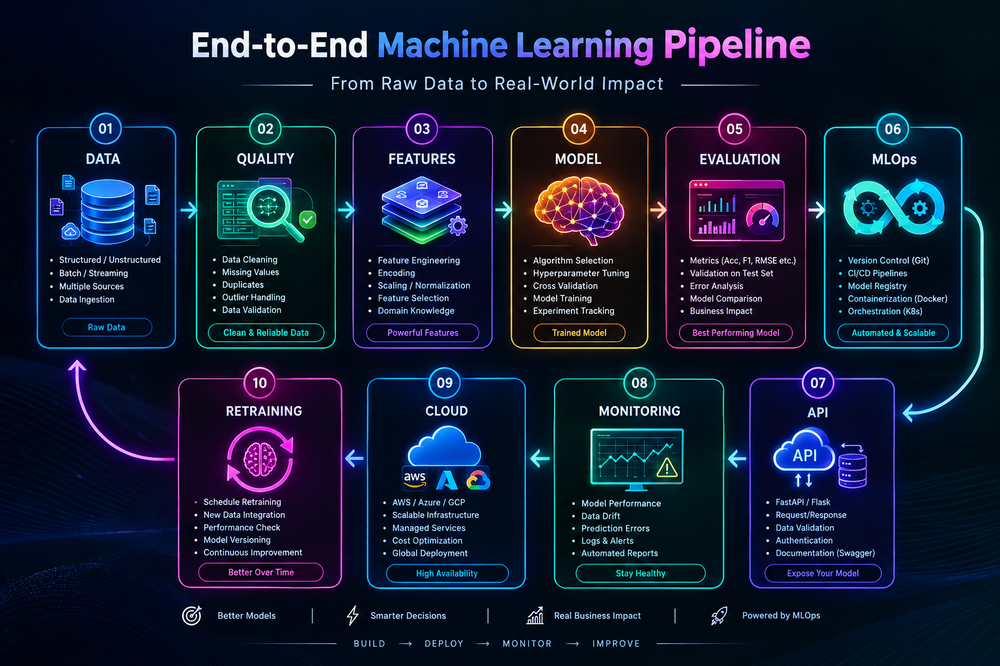

<h1 align="center">🏥 Healthcare AI System</h1>


> Production-first architecture for healthcare ML — from raw hospital data to cloud-native inference.

An end-to-end enterprise-style Machine Learning system built around hospital data, covering **data analytics, EDA, feature engineering, model training, MLOps, API serving, monitoring, governance, Docker, and AWS Kubernetes deployment**.

---

## 👨‍💻 Author

### Zainul Abedeen

**Machine Learning Engineer | MLOps Enthusiast | AI/ML Developer**

<p align="left">
  <a href="https://github.com/zainulabedeen589">
    
  </a>
  <a href="https://www.linkedin.com/in/zainulabedeen589/">
    
  </a>
  <a href="https://zainulabedeen589.netlify.app/">
    
  </a>
</p>



---

## ✨ Project Overview

This project demonstrates how a healthcare ML solution can be designed as a **complete production pipeline**, rather than as a standalone notebook model.

### 🎯 Core Prediction Systems

| System                            | Inputs               | Prediction                | Business Value                                                        |
| --------------------------------- | -------------------- | ------------------------- | --------------------------------------------------------------------- |
| **Visit Risk Classifier**   | Patient + Visit data | Low / Medium / High risk  | Helps hospital operations teams triage and allocate staff proactively |
| **Claim Outcome Predictor** | Billing + Visit data | Paid / Pending / Rejected | Helps finance teams identify rejection-prone claims before submission |

---

## 🧠 Architecture at a Glance






<!-- 

 -->

---

## ⚙️ Tech Stack


| Layer                         | Technologies                                  |
| ----------------------------- | --------------------------------------------- |
| **Data & Analytics**    | CSV, SQLite, SQL                              |
| **Data Science**        | Python, Pandas, NumPy                         |
| **Machine Learning**    | Scikit-learn, XGBoost, Random Forest          |
| **Experiment Tracking** | MLflow                                        |
| **Data Versioning**     | DVC                                           |
| **API**                 | FastAPI, Pydantic                             |
| **Interface**           | Gradio                                        |
| **Monitoring**          | PSI-based drift detection, prediction logging |
| **Packaging**           | Docker                                        |
| **Cloud**               | AWS ECR, AWS EKS, S3                          |
| **CI/CD**               | GitHub Actions                                |
| **Testing**             | Unit + API tests                              |

---

## 🔄 End-to-End ML Lifecycle



---

## 📁 Project Structure



---

# 🗄️ Dataset Overview

The system works with three core hospital datasets.

## 👤 `patients.csv` — 5,000 rows

| Column                 | Type | Description                                        |
| ---------------------- | ---- | -------------------------------------------------- |
| `patient_id`         | int  | Primary key                                        |
| `age`                | int  | Patient age (1–90)                                |
| `gender`             | str  | M / F                                              |
| `city`               | str  | Hyderabad, Pune, Chennai, Bangalore, Mumbai, Delhi |
| `insurance_provider` | str  | SecureLife, HealthPlus, CareOne, MediCareX         |
| `chronic_flag`       | int  | 1 = has chronic condition, 0 = none                |
| `registration_date`  | date | First registration at hospital                     |

---

## 🏥 `visits.csv` — 25,000 rows

| Column                   | Type  | Description                                          |
| ------------------------ | ----- | ---------------------------------------------------- |
| `visit_id`             | int   | Primary key                                          |
| `patient_id`           | int   | Foreign key → patients                              |
| `visit_date`           | date  | Date of visit                                        |
| `department`           | str   | Cardiology, Orthopedics, ICU, General, ER, Neurology |
| `visit_type`           | str   | ER, OPD, ICU                                         |
| `length_of_stay_hours` | float | Duration of admission                                |
| **`risk_score`** | str   | **Target A — Low / Medium / High**            |
| `doctor_id`            | int   | Attending doctor (100–200)                          |

---

## 💳 `billing.csv` — 25,000 rows

| Column                     | Type  | Description                                     |
| -------------------------- | ----- | ----------------------------------------------- |
| `bill_id`                | int   | Primary key                                     |
| `visit_id`               | int   | Foreign key → visits                           |
| `billed_amount`          | float | Amount charged by hospital                      |
| `approved_amount`        | float | Amount approved by insurer (nullable)           |
| **`claim_status`** | str   | **Target B — Paid / Pending / Rejected** |
| `payment_days`           | float | Days to payment (nullable)                      |
| `billing_date`           | date  | Date bill was raised                            |

---

# 🚀 Quick Start

## Prerequisites

- Python 3.10+
- [uv](https://astral.sh/uv) — fast Python package manager

## 1. Clone the Repository

```bash
git clone <your-repo-url>

cd Healthcare
```

## 2. Create Virtual Environment

```bash
uv venv
```

### Windows / Git Bash

```bash
source .venv/Scripts/activate
```

### macOS / Linux

```bash
source .venv/bin/activate
```

## 3. Install Dependencies

```bash
uv pip install -r requirements.txt
```

## 4. Launch Jupyter

```bash
jupyter notebook
```

---

# 🧪 Run the Project Phase by Phase

### Phase 1 — SQL Analytics

```bash
jupyter notebook notebooks/Phase1_SQL.ipynb
```

### Phase 2 — EDA

```bash
jupyter notebook notebooks/Phase2_EDA.ipynb
```

### Phase 3 — ML Modeling

```bash
jupyter notebook notebooks/Phase3_Modeling.ipynb
```

### Phase 4 — MLflow

```bash
jupyter notebook notebooks/Phase4_Mlflow.ipynb
```

---

# 📈 MLflow

## Run the MLflow UI

```bash
mlflow ui
```

## Production MLflow Server

```bash
mlflow server \

  --backend-store-uri sqlite:///mlflow.db \

  --default-artifact-root ./mlruns \

  --host 127.0.0.1 \

  --port 5000
```

---

# 🤖 Run the Training Pipeline

### Visit Risk Model

```bash
python -m src.training_pipeline --model risk
```

### Claim Outcome Model

```bash
python -m src.training_pipeline --model claim
```

---

# 🔁 DVC Pipeline

For the DVC pipeline, keep the MLflow server running in another terminal.

## Risk Pipeline

```bash
dvc stage add \

  -n train_risk \

  -d src \

  -d outputs/model_table.csv \

  -o models/risk_model_complete_pipeline.joblib \

  -o outputs/feature_schema.json \

  python -m src.training_pipeline --model risk
```

## Claim Pipeline

```bash
uv run dvc stage add \

  -n train_claim \

  -d src \

  -d outputs/model_table.csv \

  -d outputs/feature_schema.json \

  -o models/claim_model_complete_pipeline.joblib \

  python -m src.training_pipeline --model claim
```

---

# ⚡ API & UI

## Run FastAPI

```bash
uvicorn api.main:app --reload
```

API documentation:

```text
http://localhost:8000/docs
```

## Run Gradio UI

```bash
python ui/gradio_app.py
```

---

# ☁️ AWS Deployment

## ECR Creation

```bash
aws ecr create-repository --repository-name healthcare-api --region us-east-1

aws ecr create-repository --repository-name healthcare-gradio --region us-east-1
```

## AWS CLI Configuration

Before deployment, ensure:

- AWS account is created
- IAM user is created
- Required ECR and S3 permissions are configured
- Access keys are generated for the IAM user

### Configure AWS CLI

```bash
aws configure
```

Enter:

```text

AWS Access Key ID: <your-access-key>

AWS Secret Access Key: <your-secret-key>

Default region name: us-east-1

Default output format: json
```

> ⚠️ Never commit AWS credentials or secret keys to Git.

### Verify Configuration

```bash
aws sts get-caller-identity
```

Expected structure:

```json
{

  "UserId": "...",

  "Account": "...",

  "Arn": "arn:aws:iam::...:user/..."

}
```

## 🔐 Login to Amazon ECR

```bash
aws ecr get-login-password \

  --region us-east-1 | \

  docker login \

  --username AWS \

  --password-stdin <account-id>.dkr.ecr.us-east-1.amazonaws.com
```

### Docker Tag Examples

```bash
docker tag healthcare-api:latest <account-id>.dkr.ecr.us-east-1.amazonaws.com/healthcare-api:latest

docker tag healthcare-gradio:latest <account-id>.dkr.ecr.us-east-1.amazonaws.com/healthcare-gradio:latest
```

### Docker Push Examples

```bash
docker push <account-id>.dkr.ecr.us-east-1.amazonaws.com/healthcare-api:latest

docker push <account-id>.dkr.ecr.us-east-1.amazonaws.com/healthcare-gradio:latest
```

---

# 🗃️ DVC + Amazon S3

Configure an S3 remote for DVC:

```bash
dvc remote add -d myremote s3://amzn-s3-healthcare/dvc-store
```

Verify:

```bash
dvc remote list

dvc status
```

Push:

```bash
dvc push
```

---

# ☸️ EKS Setup

```bash
choco install eksctl -y
```

### Set Environment Variables

```bash
export AWS_REGION=us-east-1

export CLUSTER_NAME=healthcare-eks

export ECR_REGISTRY=<account-id>.dkr.ecr.us-east-1.amazonaws.com
```

### Required Policies

```text

AmazonEKSClusterPolicy

AmazonEKSServicePolicy

AmazonEKSWorkerNodePolicy

AmazonEC2ContainerRegistryReadOnly
```

### Create EKS Cluster

```bash
eksctl create cluster \

  --name healthcare-eks \

  --region us-east-1 \

  --nodes 2 \

  --node-type t3.medium \

  --managed
```

### Verify Cluster

```bash
eksctl get cluster --region us-east-1
```

### Configure kubeconfig

```bash
aws eks update-kubeconfig \

  --region us-east-1 \

  --name healthcare-eks
```

### Verify Kubernetes Connectivity

```bash
kubectl get nodes

kubectl get pods -A
```

---

# 🚢 Deploy to Kubernetes

```bash
kubectl apply -f k8s/
```

Verify the deployment:

```bash
kubectl get deployments

kubectl get pods

kubectl get svc
```

---

# 📊 Model Performance

| Model                   | Algorithm                       |  Test Accuracy |    Weighted F1 |
| ----------------------- | ------------------------------- | -------------: | -------------: |
| Visit Risk              | Logistic Regression (baseline)  |           ~91% |           0.90 |
| Visit Risk              | Random Forest                   |           ~95% |             94 |
| **Visit Risk**    | **XGBoost (final)**       | **~95%** | **0.94** |
| Claim Outcome           | Logistic Regression (baseline)  |           ~47% |           0.43 |
| **Claim Outcome** | **Random Forest (final)** | **~55%** | **0.51** |

> ⚠️ **Important:** The project intentionally demonstrates two data scenarios — random synthetic labels (Phase 3A) and clinically-derived labels (Phase 3B). The above numbers reflect Phase 3B (good data). Claim data still needs to be fixed.

---

# 🔍 Key Engineering & ML Lessons

### 1. Label Quality > Model Tuning

The same pipeline demonstrates a major improvement in accuracy by fixing the underlying data/labels rather than simply tuning the model.

### 2. Time-Based Train/Test Split

Temporal data requires leakage-safe evaluation using time-aware train/test splitting.

### 3. Class Imbalance

The project demonstrates techniques including:

- `class_weight`
- `balanced_subsample`
- SMOTE

### 4. Bias–Variance Tradeoff

The project demonstrates Random Forest overfitting and the effect of correcting it:

```text

97% Train Accuracy

        ↓

      Model

        ↓

43% Test Accuracy

        ↓

Overfitting Analysis

        ↓

Model Improvement
```

### 5. Fairness Analysis

Model performance is evaluated across:

- Gender
- City
- Insurance provider

### 6. Production API Design

The serving layer includes:

- Input validation
- Prediction logging
- Model versioning

### 7. Drift Detection

PSI-based monitoring provides an early warning mechanism for potential model degradation.

---

# 📝 Assignment

> **Fix Claim Data labels and then train the model.**

---

# 🏛️ Governance

The project includes dedicated governance documentation:

- **Model Card** — `report/model_card.md`
- **Monitoring Strategy** — `report/monitoring_strategy.md`
- **Retraining Plan** — PSI threshold `0.2` triggers the retraining pipeline

---

## 🧩 Production Mindset



**The goal is not just to train a model.
The goal is to build a system that can be trained, evaluated, served, monitored, versioned, and improved.**

---
